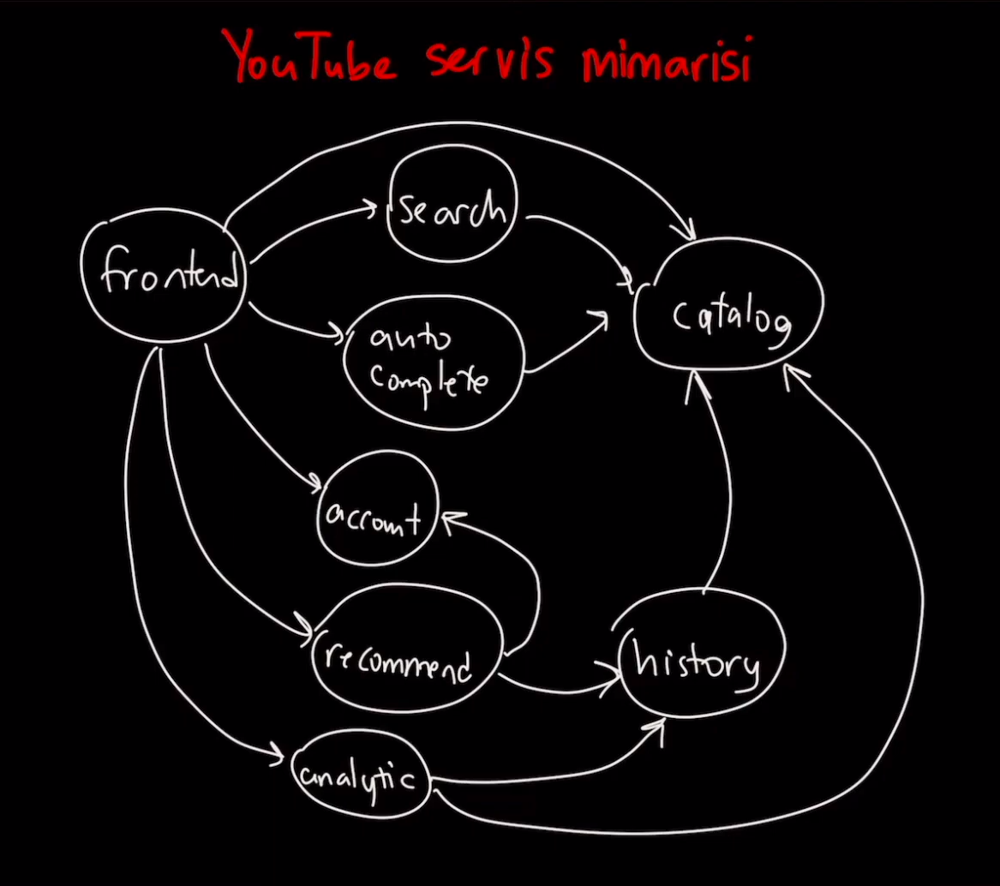

[](https://classroom.github.com/a/Z1kPkJOi)

# 1.Hafta Ödevi

**1. Java dünyasındaki framework’ler ve çözdükleri problemler nedir? Kod Örneklendirini de içermelidir. `(5 Puan)`**

   **Spring Framework**
    - Çözdüğü problem: Kurumsal uygulamaların geliştirilmesi ve yönetimi.
    - Örnek Kullanım: Bağımlılık enjeksiyonu ve aspect-oriented programming (AOP) gibi özellikleri kullanarak web
      uygulamalarının geliştirilmesi.

   ```java

    public class MyService {
        private MyRepository repository;
    
        // Yapıcı metot ile DI
        public MyService(MyRepository repository) {
            this.repository = repository;
        }
    
        // Metot ile DI
        public void setRepository(MyRepository repository) {
            this.repository = repository;
        }   
    }
   ```

   **Hibernate**
    - Problemi: Nesne ilişkilendirme işlemleri ve veritabanı etkileşimi.
    - Örnek Kullanım: Veritabanı işlemlerini Java nesneleri üzerinde gerçekleştirmek için nesne ilişkilendirme
      haritalama sağlar.

   ```java
   
   @Entity
   @Table(name = "users")
   public class User {
       @Id
       @GeneratedValue(strategy = GenerationType.IDENTITY)
       private Long id;
   
       private String username;
       private String email;
       
   }
   ```

   **Apache Kafka**
    - Problemi: Yüksek ölçeklenebilirlik gerektiren, gerçek zamanlı veri akışı işleme ve mesajlaşma.
    - Örnek Kullanım: Uygulamalar arası güvenilir mesajlaşma sağlar.

   ```java
   
    Properties props = new Properties();
    props.put("bootstrap.servers", "localhost:9092");
    props.put("acks", "all");
    props.put("retries", 0);
    props.put("batch.size", 16384);
    props.put("linger.ms", 1);
    props.put("buffer.memory", 33554432);
    props.put("key.serializer", "org.apache.kafka.common.serialization.StringSerializer");
    props.put("value.serializer", "org.apache.kafka.common.serialization.StringSerializer");
    
    Producer<String, String> producer = new KafkaProducer<>(props);
    producer.send(new ProducerRecord<String, String>("my-topic", "key", "value"));
    producer.close();
   ```

   **JUnit**
    - Problemi: Birim testlerin yazılması ve çalıştırılması.
    - Örnek Kullanım: Testlerin otomatik çalıştırılmasını ve sonuçlarının değerlendirilmesini sağlar.

   ```java
   import org.junit.Test;
   import static org.junit.Assert.assertEquals;
   
   public class MyUnitTest {
   
       @Test
       public void testAddition() {
           int result = Calculator.add(3, 5);
           assertEquals(8, result);
       }
   }
   ```

   **Apache Maven**
    - Problemi: Proje bağımlılıklarının yönetilmesi ve proje yapılandırmasının otomatikleştirilmesi.
    - Örnek Kullanım: Proje bağımlılıklarının tanımlanması ve proje derleme süreçlerinin otomatikleştirilmesi.

   ```xml
   
   <project xmlns="http://maven.apache.org/POM/4.0.0" xmlns:xsi="http://www.w3.org/2001/XMLSchema-instance"
       xsi:schemaLocation="http://maven.apache.org/POM/4.0.0 http://maven.apache.org/xsd/maven-4.0.0.xsd">
       <modelVersion>4.0.0</modelVersion>
   
       <groupId>com.example</groupId>
       <artifactId>my-project</artifactId>
       <version>1.0.0</version>
   
       <dependencies>
           <dependency>
               <groupId>junit</groupId>
               <artifactId>junit</artifactId>
               <version>4.12</version>
               <scope>test</scope>
           </dependency>
       </dependencies>
   </project>
   ```

**2. SOA - Web Service - Restful Service - HTTP methods kavramlarını örneklerle açıklayınız. `(15 Puan)`**

SOA (Service-Oriented Architecture), web hizmetleri geliştirmek için bir mimari yaklaşımıdır.
Servis odaklı mimaride, uygulamalar işlevselliği sağlamak için birbirleriyle bağlantı kurarlar.
Bu, hizmetlerin birbirinden bağımsız olduğu ve farklı teknolojilerle geliştirilebildiği anlamına gelir.
Web hizmetleri, bu mimariyi desteklemek için kullanılan bir teknoloji setidir.
<p align="center">
  
</p> 

[Referans](https://www.youtube.com/watch?v=wruopIH-_RM&ab_channel=ahmetalpbalkan)

Yukarıda görüleceği üzere servisler birbirlerine bağlıdır ve birbirleriyle iletişim kurarlar.
Bu kodun tekrarlanmasını önler kodun daha güvenli ve dayanıklı olmasını sağlar. Yatay ölçeklemeye müsaittir. Örnek
vermek gerekirse search servisinin önüne konuşlandırılan bir load balancer ile search servis sayısı arttırılabilir.
Ancak resource kullanımı mikro servis mimarisine nazaran daha fazladır.

Web Servisleri, farklı platformlar arasında iletişim kurmak için kullanılan standart tabanlı bir teknolojidir. SOAP (
Simple Object Access Protocol) ve REST (Representational State Transfer), RPC gibi protokollerle iletişim sağlarlar. SOAP,
XML tabanlı bir iletişim protokolüdür ve genellikle XML-RPC veya HTTP üzerinden iletişim kurar. REST ise daha hafif ve
esnek bir yaklaşımdır ve genellikle HTTP protokolünü kullanarak JSON veya XML gibi formatlarda veri alışverişi yapar. Rest stateles 
bir yapıya sahiptir. Yani her istek birbirinden bağımsızdır. Server client hakkında client da server hakkında bilgi tutmaz.
Tüm bilgi isteklerde gönderilir.

HTTP Methods, HTTP protokolü üzerinden yapılan isteklerin türlerini belirtir. En çok kullanılan HTTP methodları şunlardır:
- GET: Belirtilen kaynağın alınmasını sağlar.
- POST: Belirtilen kaynağa yeni bir kayıt ekler.
- PUT: Belirtilen kaynağın güncellenmesini sağlar.
- DELETE: Belirtilen kaynağı siler.
- PATCH: Belirtilen kaynağın kısmi güncellemesini sağlar.


**3. Singleton ve Factory pattern kullanarak projedeki objeleri oluşturun. `(10 Puan)`**

**4. Aşağıdaki eksiklikleri [**bizimkredi**](https://github.com/Definex-Java-Spring-Bootcampp/kredinbizden-service)
   projesine ekleyin. `(50 Puan)`
    * Aynı e-mail adresi ile bir kullanıcı kayıt olabilir.
    * Kullanıcının şifresi **SHA-512** ile şifrelenerek kullanıcı oluşturulmalıdır.
    * En çok başvuru yapan kullanıcıyı bulan methodu yazın.
    * En yüksek kredi isteyen kullanıcıyı ve istediği tutarı bulan methodu yazın.
    * Son bir aylık yapılan başvuruları listeleyen methodu yazın.
    * Kampanya sayısı en çoktan aza doğru olacak şekilde kredi kartı tekliflerini listeleyen methodu yazın.
    * cemdrman@gmail.com mail adresine sahip kullanıcının bütün başvurularını listeleyen methodu yazın.(Parametrik
      şekilde çalışmalıdır.)**

**5. Bir müşteri, ürün, sipariş ve fatura objeleri olacak şekilde online alışveriş sistemi tasarlayın. `(20 PUAN)`
    * Bir müşteri birden fazla sipariş verebilir.
    * Bir sipariş içerisinde birden fazla ürün olabilir.
    * Ürünün kategorisi, fiyatı, ismi ve stok bilgisi vardır.
    * Her siparişin bir faturası vardır.**

> Bu kurallar çerçevesinde derste öğrendiğimiz **OOP** kavramlarını ve **Collection Framework** yapılarını örnekleyin.
> > Sadece derslerde yaptığımız gibi Main method üzerinden gerekli instance oluşturması yapılacaktır ekstra bir yapıya
> > ihtiyaç yoktur.

* Bu doğrultuda aşağıdaki soruların cevaplarını yazan kodu yazınız.
    - Sistemdeki bütün müşterisi sayısını bulan,
    - İsmi Cem olan müşterilerin aldıkları ürün sayısını bulan,
    - İsmi Cem olup yaşı 30’dan küçük 25’ten büyük müşterilerin toplam alışveriş tutarını hesaplayın,
    - Sistemdeki 1500 TL üzerindeki faturaları listeleyin.

---
***Eğitmen - Cem DIRMAN*  
*Kolay Gelsin***  
